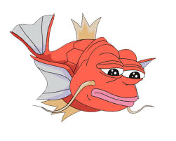
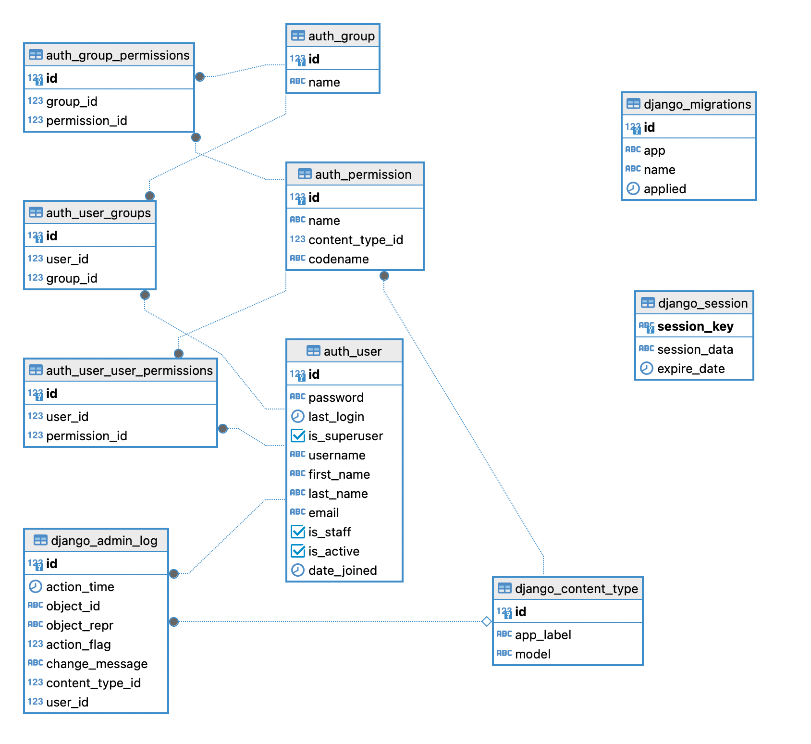
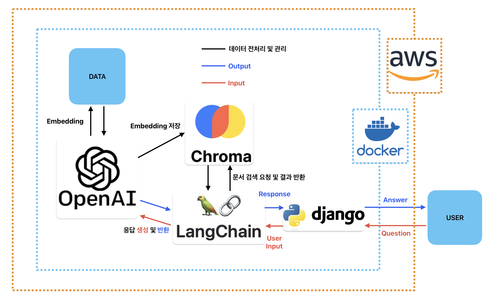
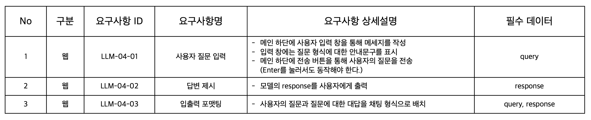
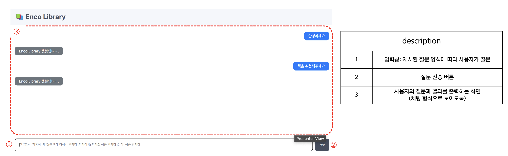
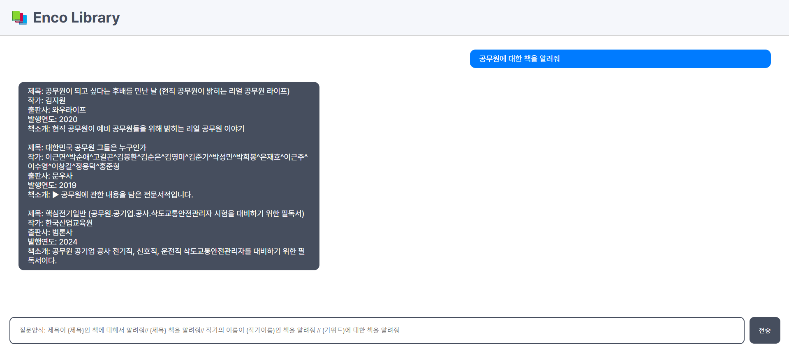
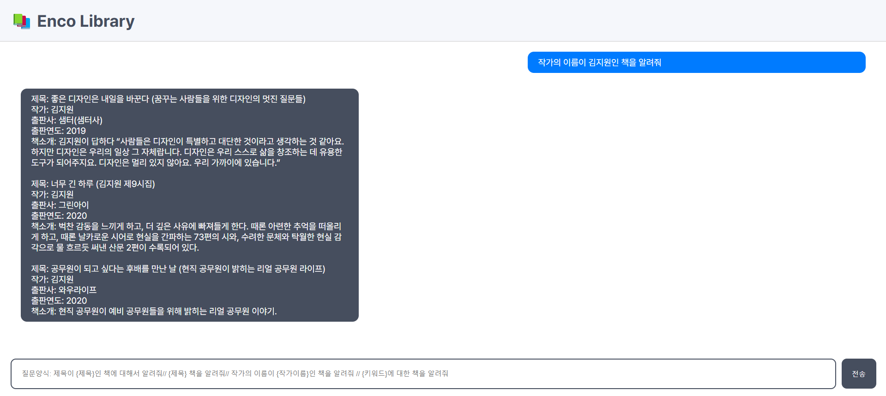
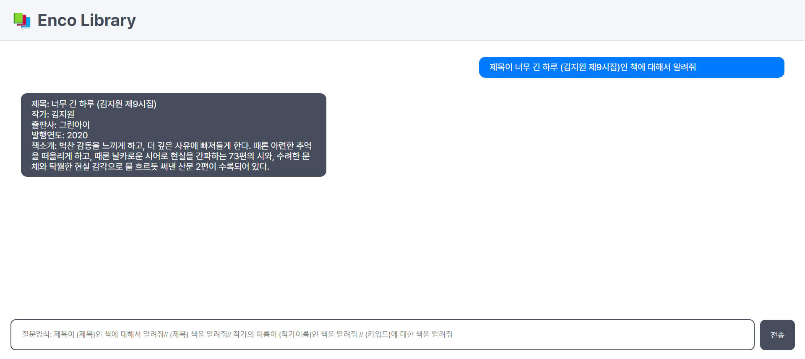
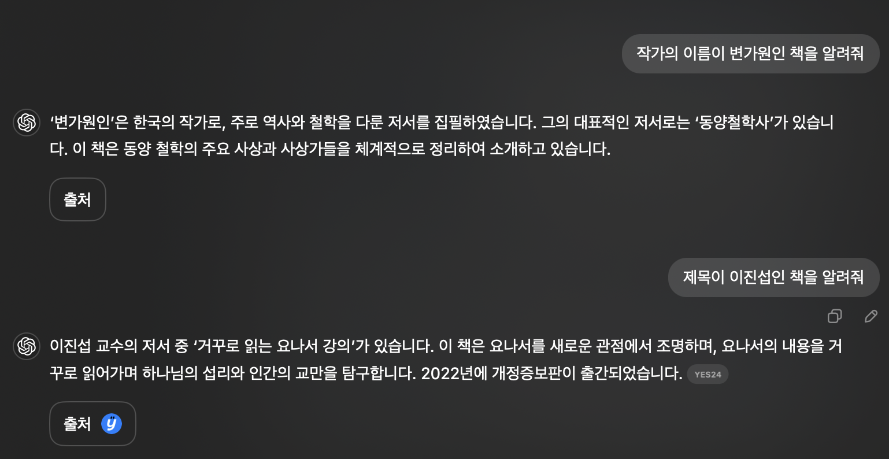
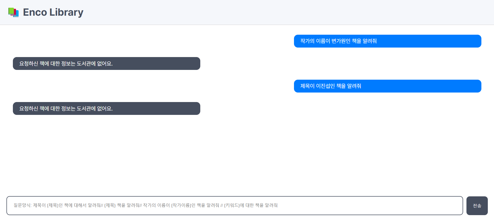

## 👑 팀명 : 퀸🫅 & 킹🤴 그리고 잼민이들🤦‍♂️<br>

<p align="center"></p>

### 🐿️ 팀원

|                                                        오정연                                                        |                         이호재                          |                                                        변가원                                                        |                                                        이진섭                                                        |                       김태욱                        |
| :------------------------------------------------------------------------------------------------------------------: | :-----------------------------------------------------: | :------------------------------------------------------------------------------------------------------------------: | :------------------------------------------------------------------------------------------------------------------: | :-------------------------------------------------: |
|  |  |  |  |  |
|                                       [@Jungyunn](https://github.com/Jungyunn)                                       |            [@HoJL](https://github.com/HoJL)             |                                         [@dnjsrk](https://github.com/dnjsrk)                                         |                                        [@jururuj](https://github.com/jururuj)                                        |     [@Taeuk-Dog](https://github.com/Taeuk-Dog)      |
|                                          **Project Leader**<br/>LLM<br>AWS                                           |            Lead Developer <br>Backend<br>AWS            |                                                 Frontend <br>ReadMe                                                  |                                                  Backend<br>ReadMe                                                   |                         AWS                         |

</div>

<hr>

### 🎖️ 프로젝트 개요

hallucination이 없는 챗봇 시스템 페이지 구현

<hr>

### 🎖️ 프로젝트 목표

'Enco Library Chatbot'은 'Enco Library'가 소장한 도서에 대해 검색을 했을 때 hallucination이 없는 답변을 제공하는 채팅 페이지를 보여주는 것을 목표로 합니다.

<hr>

### 🔨 기술 스택

<div>

_Environment_
<br><br>


_Development_
<br><br>


<hr>

### Prerequisites

**이 프로젝트를 실행하기 위해 필요한 패키지 등을 정의**

```cmd
pip install -r requirements.txt, langchain을 이용하기위한 .env파일 정의, docker env 파일
```

<hr>

### Usage

**이 코드를 실행하기 위해 어떠한 코드를 어떻게 실행해야 하는지 작성**

```cmd
python manage.py runserver
```
### 실행 환경
```
AWS 내의 docker 환경에서 실행
- t2.medium 4GiB 메모리
- 80GiB 스토리지 사용
```

<hr>

### Data

국립중앙도서관 Linked Open Data(LOD)의 텍스트 기반의 일반 도서 정보 데이터셋 (이미지 클릭)
<br>
<br>
<a href='https://lod.nl.go.kr/home/dataset/datadownload.do'></a>
<br>
<br>

네이버 책 api (이미지 클릭)
<br>
<br>
<a href='https://developers.naver.com/docs/serviceapi/search/book/book.md'></a>
<br>
<br>
_data column_

```
"title": 제목
"author": 작가
"publisher": 출판사
"pubdate": 출판연도
"description": 책소개
```

_ERD_


<br>

<hr>

### Preprocess

국립중앙도서관의 약 20,000개의 책 데이터에서 책 제목만 추출하여,
추출한 제목을 가지고 네이버 책 api를 통해 제목, 작가, 출판사, 출판연도, 책소개를 크롤링하여 데이터를 만들었습니다.

<hr>

### System Architecture

 <br>

<hr>

### 수행 결과

#### 요구사항 정의서

 <br>

#### 화면 설계서

 <br>

#### 실행 결과

-해당 주제 관련 책 추천
 <br> -해당 저자가 쓴 책 찾기
 <br> -해당 제목을 가진 책 찾기
 <br>

#### Hallucination

-gpt-4o-mini
 <br> -프로젝트 모델
 <br>

기존 GPT에서 책에 대한 추천이나 정보를 물어봤을 때, 존재하지 않는 책을 추천해주는 등 제대로 답변이 나오지 않는 Hallucination 발생했었습니다. 그러나 프로젝트를 진행하면서 데이터에 존재하는 책들에 대한 추천과 설명을 확실하게 해주며 없는 책에 대한 것은 없으면 없다고 응답해주도록 RAG를 사용해 Hallucination이 없는 답변을 내놓도록 하였으며, 웹을 만들어 배포까지 성공적으로 마쳤습니다.

<hr>

### 한 줄 회고

오정연 - 코드는 틀리지 않았고 내가 틀렸다. 지금까지 한 단위 프로젝트 중 가장 다사다난했지만 끝마칠 수 있어서 행복했습니다 우리팀 최고
<br>
이호재 - Lead Developer로 Backend와 AWS를 맡아 프로젝트를 성공적으로 완료하며 많은 것을 배웠습니다.
<br>
변가원 - 최종 플젝까지 화이팅! 다들 수고하셨습니다.
<br>
이진섭 - 경로 관리가 힘드네요.
<br>
김태욱 - aws를 통해 프로젝트를 진행할 수 있어서 좋았습니다.
